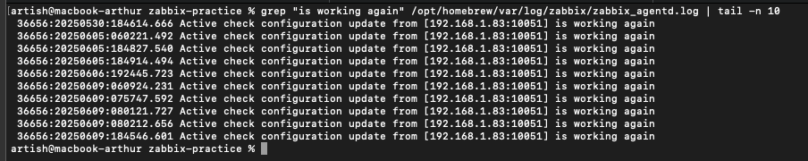

# Домашнее задание к занятию «Система мониторинга Zabbix» – Артур Ишмаков
Решение практики по Zabbix

---

**Задание 1.**  
Установите Zabbix Server с веб-интерфейсом.

**Решение:**
1. Скриншот авторизации в админке:
   
   
```bash
# Установка зависимостей
sudo apt update
sudo apt install -y wget gnupg2 lsb-release apt-transport-https ca-certificates curl

# Добавление репозитория Zabbix
wget https://repo.zabbix.com/zabbix/7.0/debian/pool/main/z/zabbix-release_7.0-1+debian12_all.deb
sudo dpkg -i zabbix-release_7.0-1+debian12_all.deb
sudo apt update

# Установка серверной части и PostgreSQL
sudo apt install -y zabbix-server-pgsql zabbix-frontend-php zabbix-apache-conf zabbix-sql-scripts zabbix-agent postgresql

# Создание базы данных и пользователя
sudo -u postgres psql -c "CREATE DATABASE zabbix;"
sudo -u postgres psql -c "CREATE USER zabbix WITH ENCRYPTED PASSWORD '12345';"
sudo -u postgres psql -c "GRANT ALL PRIVILEGES ON DATABASE zabbix TO zabbix;"

# Импорт схемы
zcat /usr/share/zabbix-sql-scripts/postgresql/server.sql.gz | sudo -u postgres psql zabbix

# Настройка доступа к БД
sudo sed -i 's/^# DBPassword=/DBPassword=12345/' /etc/zabbix/zabbix_server.conf

# Права на каталог PID
sudo mkdir -p /run/zabbix
sudo chown zabbix:zabbix /run/zabbix

# Запуск служб
sudo systemctl restart zabbix-server apache2
sudo systemctl enable zabbix-server apache2
```

**Задание 2.**
Установите Zabbix Agent на два хоста.

**Решение:**

### Скриншот: Configuration > Hosts


### Скриншот: Лог агента MacBook


### Скриншот: Monitoring > Latest data (MacBook)


### Использованные команды

```markdown
#### На Zabbix-сервере:
```bash
sudo apt install zabbix-agent
sudo systemctl enable zabbix-agent
sudo systemctl start zabbix-agent
```
